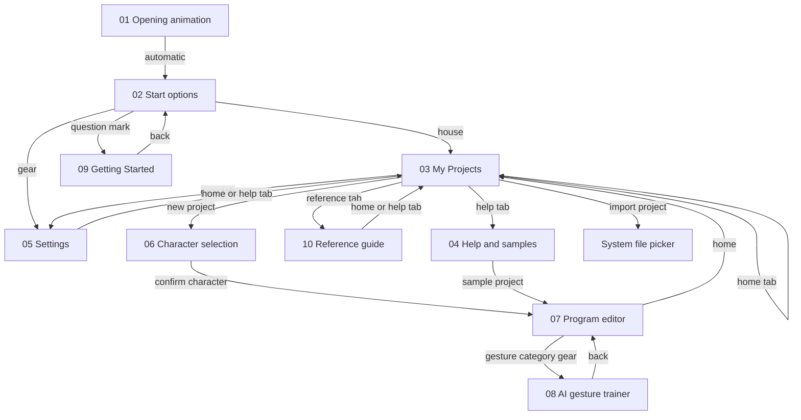
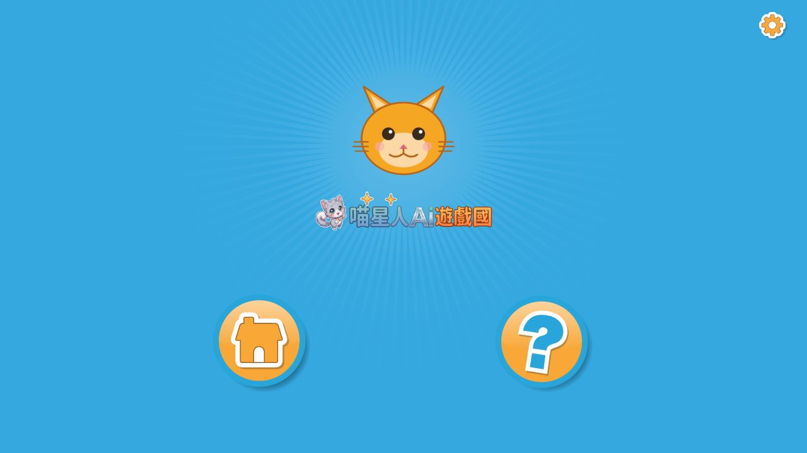
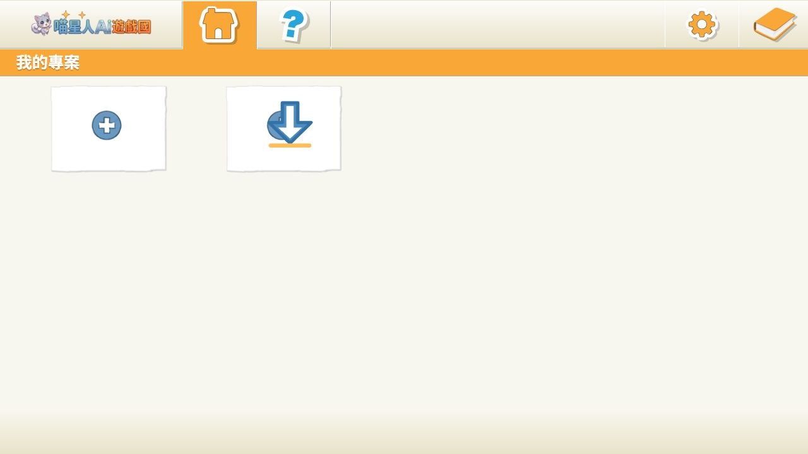
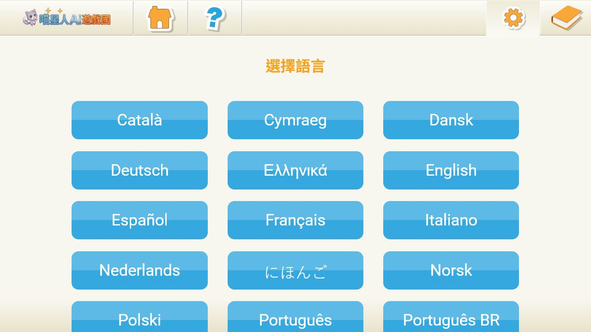
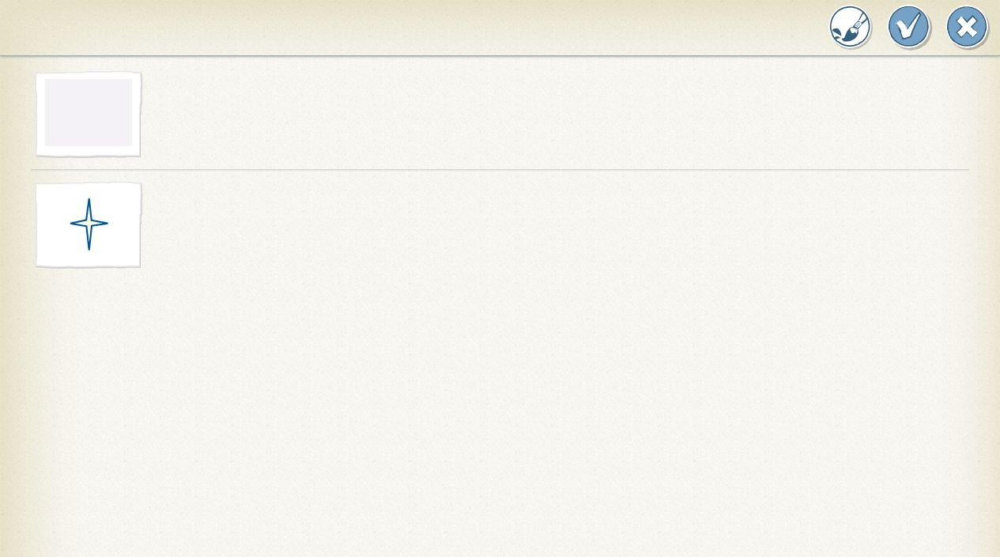
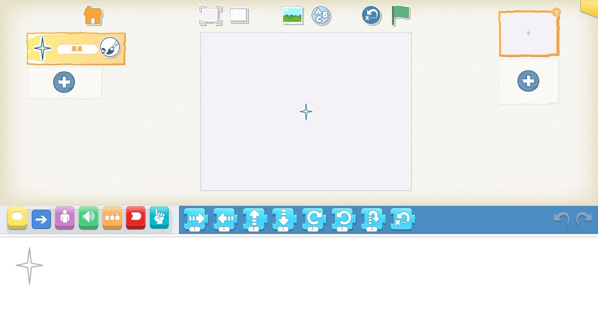
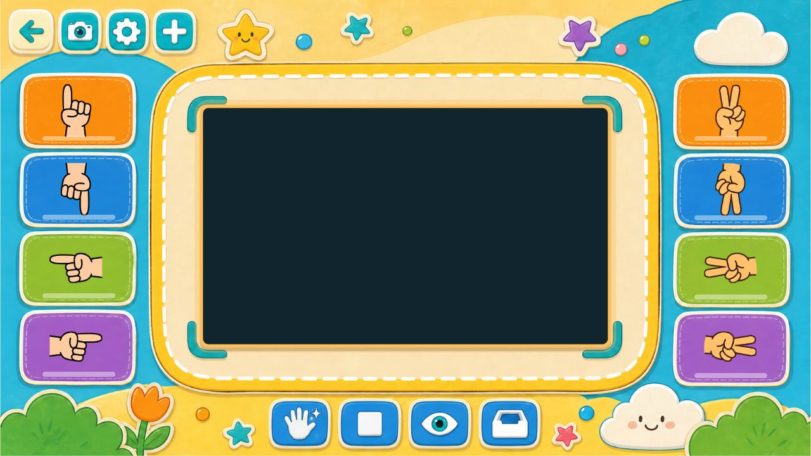
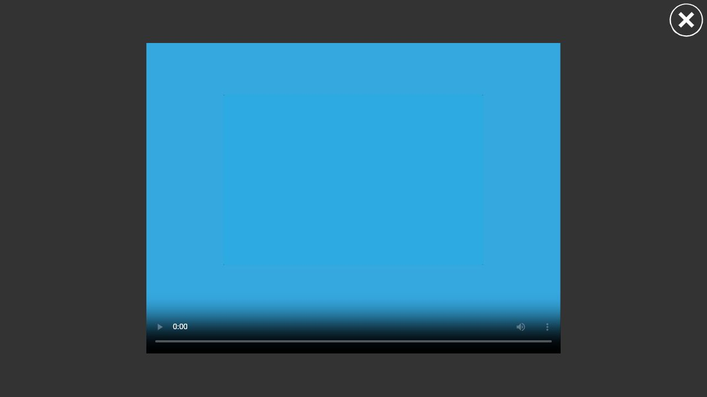
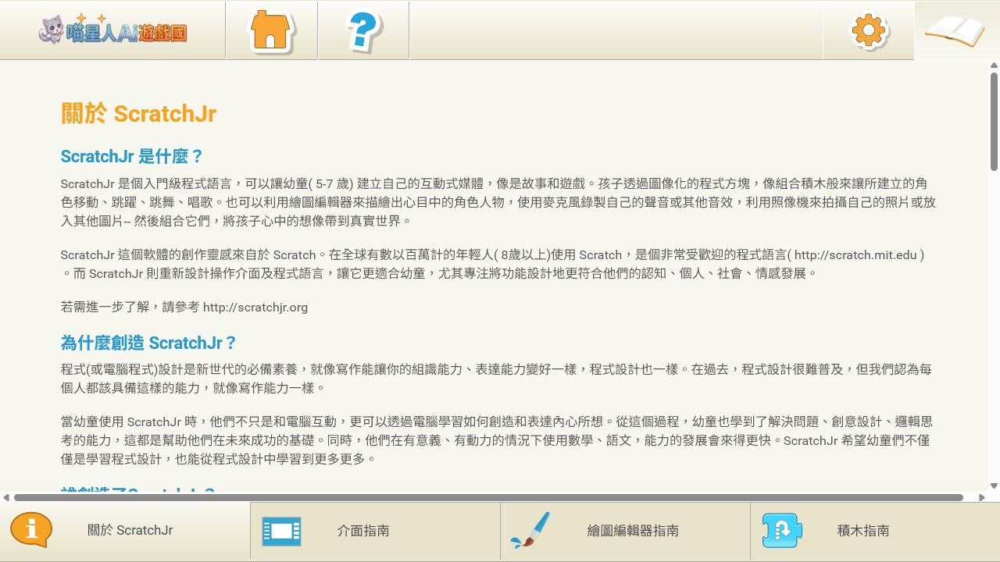

# ScratchJr AI UI Flow Audit

Audit date: 2026-07-11  
Viewport: 1280 x 720 landscape  
Build: local production bundle

## Page Relationship Map

## Navigation Results

| From | Action | To | Result |
|---|---|---|---|
| Opening animation | Wait | Start options | PASS |
| Start options | House | My Projects | PASS |
| My Projects | Help tab | Help and samples | PASS |
| My Projects | Gear tab | Settings | PASS |
| My Projects | Reference tab | Reference guide | PASS |
| My Projects | New project | Character selection | PASS, fixed in this audit |
| Character selection | Confirm | Program editor | PASS |
| Program editor | Gesture settings | AI gesture trainer | Route and page load PASS |

## Screenshots

### 01 Opening Animation

### 02 Start Options

### 03 My Projects

### 04 Help And Samples

### 05 Settings

### 06 New Project Character Selection

### 07 Program Editor

### 08 AI Gesture Trainer

### 09 Getting Started

### 10 Reference Guide

## Findings

- Fixed: New Project failed because the project-name scanner treated the Import Project tile as a saved project.
- The editor and AI trainer were not visually modified during this repair.
- No overlap or broken-image problem was observed at the audited landscape viewport.
- Camera content and landmark alignment still require a physical-device camera test.
- Android and iPad portrait/landscape acceptance remains a separate physical-device check.

